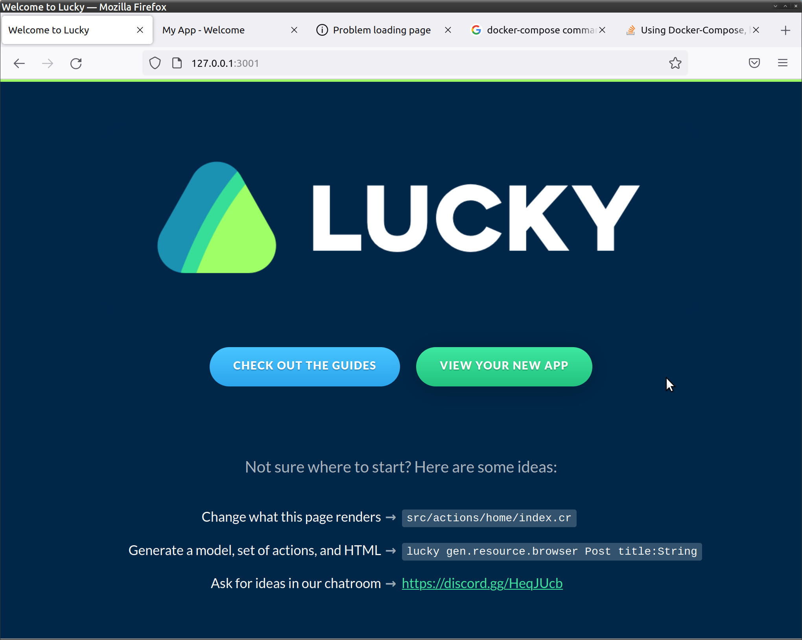
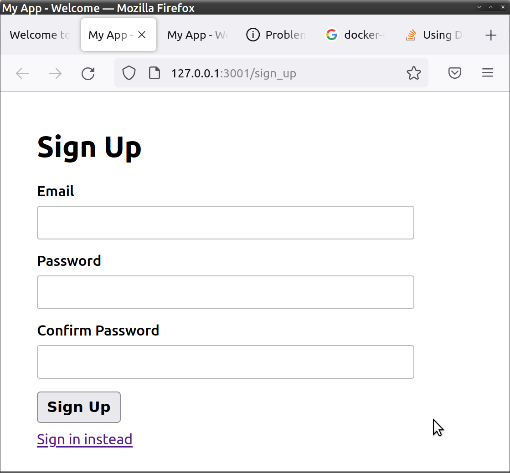
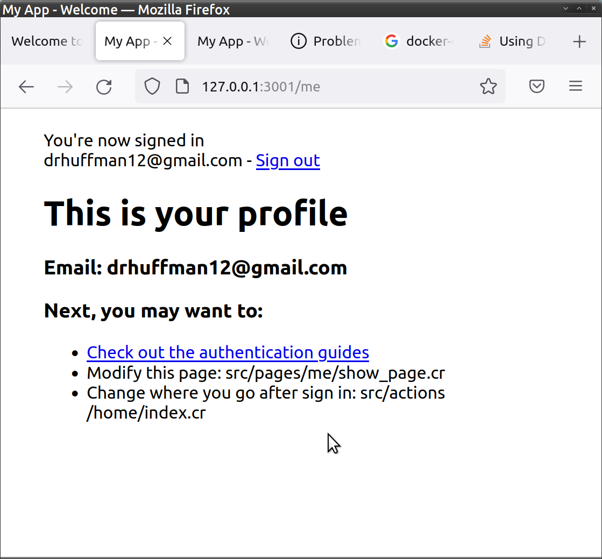

# my_app

This is a project written using [Lucky](https://luckyframework.org). Enjoy!

## Setting up the project

### With Docker:

* Build:

    ```
    docker-compose build
    ```

* Start the app:

    ```
    docker-compose up
    ```

* Browse to: http://127.0.0.1:3001
  

* Click `View Your New App`

* (1st time) Sign Up to create a Login:
  

* This will redirect you to your `me` profile page:
  

### 'Traditional' way (without Docker):

1. [Install required dependencies](https://luckyframework.org/guides/getting-started/installing#install-required-dependencies)
1. Update database settings in `config/database.cr`
1. Run `script/setup`
1. Run `lucky dev` to start the app

## Learning Lucky

Lucky uses the [Crystal](https://crystal-lang.org) programming language. You can learn about Lucky from the [Lucky Guides](https://luckyframework.org/guides/getting-started/why-lucky).
